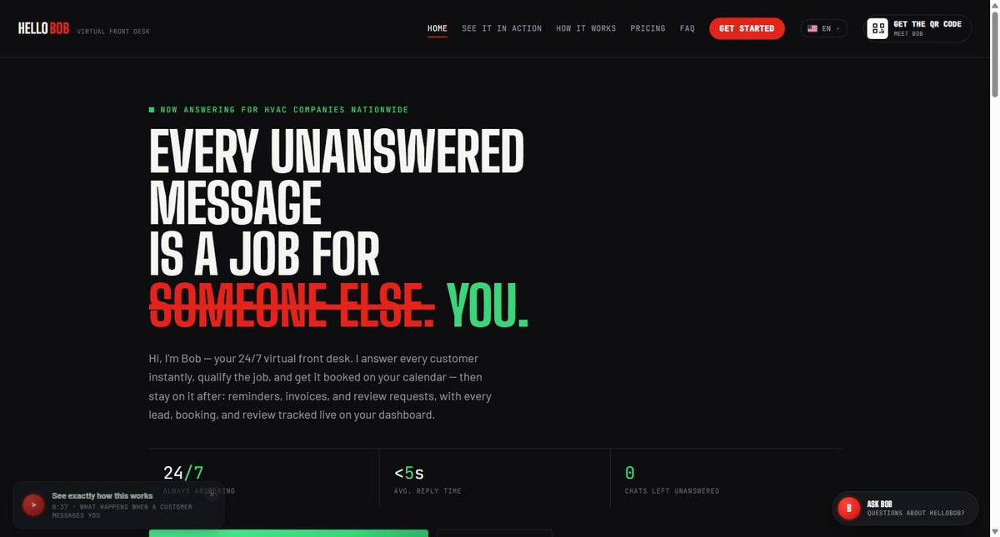
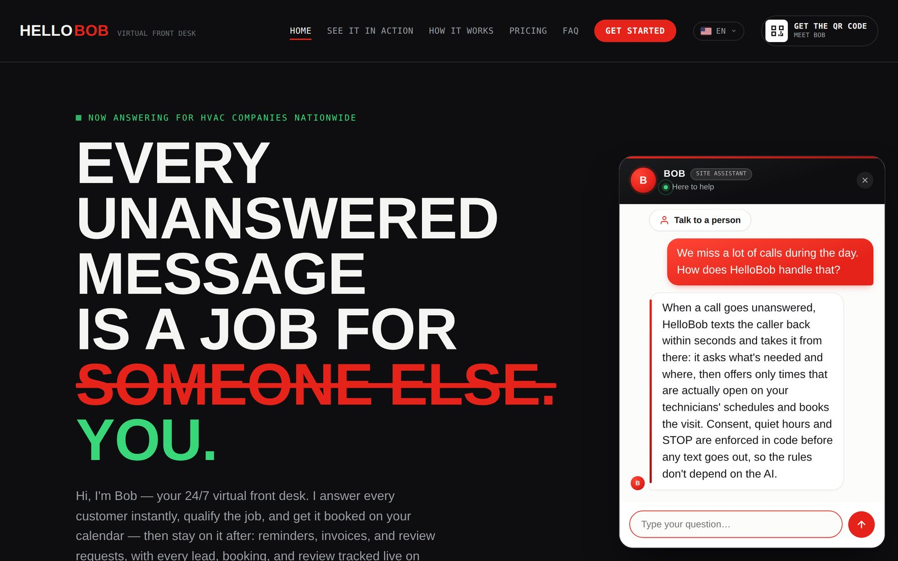
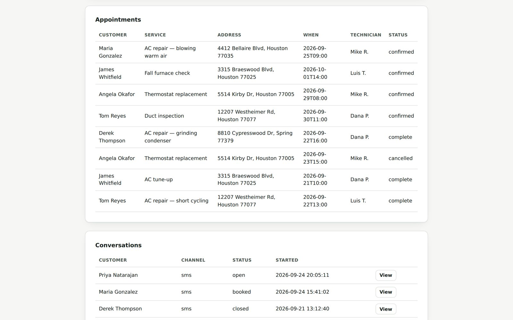

# HelloBob — AI front desk for home-service businesses

When an HVAC company misses a call, HelloBob texts the caller back within seconds, has a real conversation, qualifies the job, and books it into an open technician slot — with the texting-compliance rules enforced in code, not left to the AI.

Demo: https://gilbertrenteria.github.io/hellobob-backend/ · Built by Gilbert Renteria · 64 automated tests, zero npm dependencies

## Screenshot



## Screenshots

Ask Bob website chat



Owner dashboard (demo data)



## Why I built it

I've run service-style businesses — a restaurant, construction work — where the phone rings while your hands are busy, and a call you can't pick up is usually a job that goes to whoever answers next. HelloBob is the front desk I wished I'd had: it texts back within seconds, asks the questions a good dispatcher would ask, and books the visit against the technicians' real availability instead of guessing. I wanted something an owner could switch on without hiring anyone, and something I could stand behind on the compliance side.

## What it does

- **Missed call or text → SMS conversation.** Twilio reports the unanswered call; HelloBob sends one text back and then holds the conversation using Claude, scoped to that one business's hours, services, pricing, and policies.
- **Qualifies the job.** Bob asks what's needed and where, and only proposes times after checking what's actually open.
- **Books against real availability.** Claude can call two tools, `check_availability` and `book_appointment`, but the in-house booking engine — not the model — decides which slots exist, filters out anything already taken or in the past, and blocks double-bookings at the moment of booking.
- **Compliance gate in code.** Every outbound text passes through `canSend()` first: which consent type it needs (reply-consent vs. full-consent), the business's quiet hours, tighter per-state rules (FL, OK, WA, MD, CT, TX, NY), and STOP/unsubscribe. The yes/no consent answer is parsed by a regex, never by the AI.
- **Owner dashboard.** Invite-only accounts (admin creates the business, owner gets a "set your password" email), scrypt-hashed passwords, HttpOnly session cookies. Owners manage technicians and hours, time off, appointments, and conversation transcripts.
- **Website "Ask Bob" chat + sign-up.** The marketing site's chat runs on the same backend; when a visitor is ready, Bob captures their business name, email, and phone, saves it, and sends both a welcome email and an owner notification via Resend.
- **Dry-run mode with no keys.** With no API keys set, the server logs exactly what it would have sent to Claude and Twilio instead of calling them — the whole flow can be exercised end to end before paying for anything.

## How it's built

| Layer | What's used |
|---|---|
| Runtime | Node.js 22 built-ins only: `node:sqlite` (database), global `fetch` (all outbound HTTP), `node:http` (server), `node:crypto` (password hashing, sessions, webhook signatures), `process.loadEnvFile()`, `node --test` |
| AI | Anthropic Claude Messages API, called directly with `fetch`; tool use for `check_availability` and `book_appointment` |
| Telephony | Twilio REST API for SMS, plus inbound webhook signature verification, both implemented directly against Twilio's HTTP contract (no `twilio` package) |
| Email | Resend API, called directly with `fetch` (invite emails, welcome emails, owner notifications) |
| Front ends | Static HTML/CSS: `docs/` marketing site + "Ask Bob" chat, `dashboard/` owner dashboard |

**Why no dependencies.** This was built in an environment where `npm install` couldn't reach the npm registry, so the whole backend uses only what Node.js 22 ships with. It turned out to be simpler to deploy — nothing to install in production, no native binaries to rebuild per platform — and there's nothing here another developer couldn't read without explanation. If the official Twilio SDK is ever wanted for something fancier (call recordings, TwiML Bins), that's a self-contained swap of one file.

```
src/
  server.js                  node:http server, routes, session cookies, static files
  config.js                  env vars, dry-run detection, demo mode
  demoSeed.js                DEMO_MODE sample workspace, seeded on an empty DB
  db.js                      SQLite schema + all data access
  businessConfig.example.js  shape of a business's config JSON
  ai/
    claude.js                Anthropic API client
    conversationEngine.js    Bob's system prompt, one conversation turn, tool handling
  booking/
    scheduler.js             real slot generation, conflict checks, double-booking guard
  compliance/
    consent.js               the canSend() gate — the most important file here
    quietHours.js            quiet-hours window logic
    stateRules.js            per-state overrides (NOT legal advice — see below)
  telephony/
    twilio.js                Twilio REST client + webhook signature check
    webhooks.js              incoming SMS/voice handlers
  auth/auth.js               invites, scrypt password hashing, sessions
  email/resend.js            Resend client
  webchat/websiteChat.js     "Ask Bob" website chat + capture_signup
  signup.js                  sign-up capture + welcome/notification emails
  routes/api.js              JSON endpoints for the owner dashboard
dashboard/                   owner dashboard (login, accept-invite, main view)
docs/                        marketing site (GitHub Pages demo)
test/                        64 tests, node --test
```

## Design decisions

- **Rules live in code, not in the model.** Consent, quiet hours, per-state rules, and STOP are checked by `canSend()` before any message leaves, and that function never looks at what the AI wrote — only at what's on file for the customer. A bad AI response cannot bypass a compliance rule.
- **The model proposes, the booking engine decides.** Claude asks for availability through a tool call, but the reply the customer sees is the scheduler's own deterministic slot listing, never the model's paraphrase. Booking re-validates the slot at the moment of writing, so two conversations can't take the same time.
- **Dry-run first.** With no keys configured the server runs the full flow and logs what it would have sent. `npm test` always runs in dry-run mode, so the suite never makes a real API call or costs money.

## Demo

- Live dashboard: https://hellobob-backend.onrender.com/dashboard — log in as `demo@hellobob.example` / `front-desk-demo` (a public demo login, not a real account).
- Set `DEMO_MODE=true` and an empty database is seeded on boot with a fictional HVAC business ("Coastline Air & Heat", Houston): 3 technicians, 6 customers, 3 SMS transcripts, consent history, and 8 appointments dated relative to today (`src/demoSeed.js`).
- On Render's free plan the SQLite file lives in `/tmp`, so every restart or redeploy wipes the workspace and re-seeds it — anything added in the dashboard is gone after the next restart. Set `DEMO_OWNER_PASSWORD` to change the demo password.
- Deploying it yourself: see [DEPLOY.md](DEPLOY.md) (Render Blueprint in `render.yaml`).

## Run it locally

```bash
cp .env.example .env   # optional — with no keys set, the server runs in dry-run mode
npm test               # 64 tests, no API keys needed
npm start              # serves on :3000 (or $PORT); dashboard at /dashboard
DEMO_MODE=true npm start   # same, with the sample workspace seeded on first boot
```

Real keys (Anthropic, Twilio, Resend) go in `.env` per the comments in `.env.example`. Twilio also needs A2P 10DLC brand/campaign registration in its own console before it will carry production SMS, and the number should have both SMS and Voice enabled — dry-run mode lets you build and test everything else while that's pending.

## Tests

`npm test` → 64 passing. They cover the consent gate and quiet-hours logic (`consent`, `quietHours`), the booking engine's slot generation and double-booking guard (`booking`), the conversation engine's tool handling (`conversationEngine`), the technician/availability API (`technicians`), the website chat and sign-up capture (`websiteChat`), and an end-to-end SMS/voice webhook flow against the real HTTP server in dry-run mode (`webhooks.integration`), plus the demo seed (idempotent, owner can log in, dates stay relative) and deployment shape (`/health`, comma-list CORS, SMS log-and-skip when Twilio is unset) (`demo`, `deploy`).

## Deploy

The quickest path is Render: `render.yaml` is a ready Blueprint and [DEPLOY.md](DEPLOY.md) walks through it click by click. More generally, any host that runs a long-lived Node.js 22+ process with a public URL works — Railway, Render, and Fly.io are all low-effort choices at this size. Set the start command to `npm start`, add the variables from `.env.example` in the platform's dashboard (never commit a real `.env`), mount a persistent volume for `data/` (or point `DB_PATH` at one) so the SQLite file survives restarts, then set `PUBLIC_BASE_URL` and point Twilio's Messaging and Voice webhooks (including the call-status callback) at `{PUBLIC_BASE_URL}/webhooks/sms` and `/webhooks/voice`. If SQLite is ever outgrown, `src/db.js` is the only file that speaks SQL.

**Not legal advice.** `src/compliance/stateRules.js` and the consent wording reflect research done during planning, not an attorney's review. Get a lawyer familiar with TCPA and state telemarketing law to sign off before relying on this for real customers, especially before scaling in Texas or New York (flagged in code as `confirmBeforeScaling`).

## Contact

gilbertrenteria@yahoo.com · linkedin.com/in/gilbertrenteria · gilbertrenteria.dev
